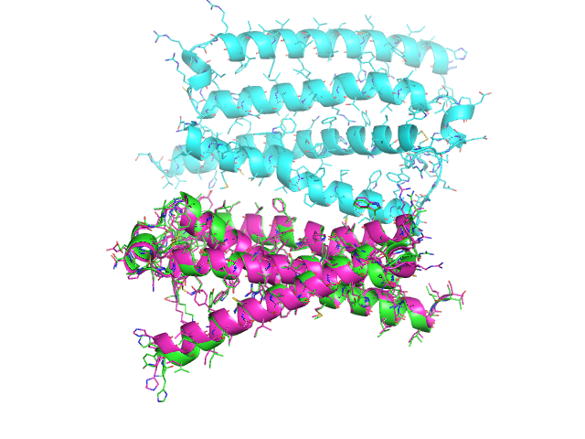
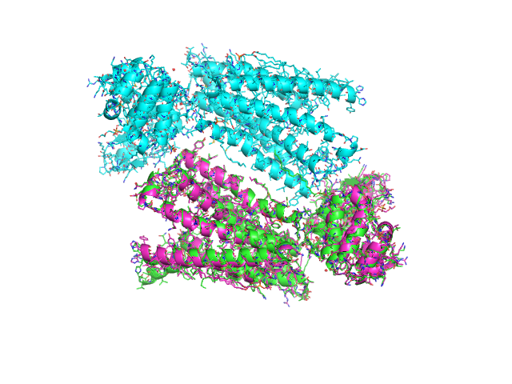
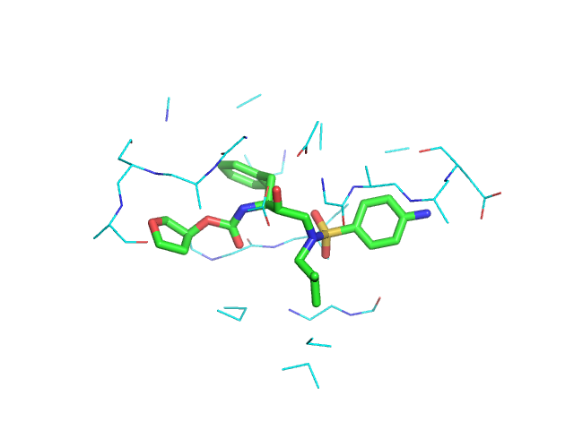
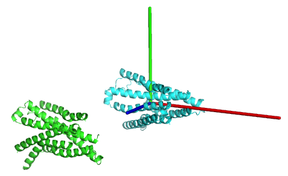

# Protein Utilities

Utilities to manipulate PDB, PQR, BGF, (mol2, mae, etc.) files.

- Django-queryset-like selection tools
- Alignment and RMSD calculations/transformations

## Build

Requires numpy and metplotlib.

    python setup.py build_ext --inplace

## Examples

### 1.0 Selections and Alignment

Download pdbs, quickly select a subsection of atoms, then align the structures

```python
>>> from protutils.pdb import PDBFile

# Download 4K5Y.pdb from RCSB Protein Data Bank
>>> pdb = PDBFile.fetch('4K5Y')
# Select residues less than 263 on chain A
>>> chain_a = pdb.select(chain__eq='A', nres__lt=263)
>>> chain_b = pdb.select(chain__eq='B', nres__lt=263)
# Align selection with another selection that contains the same number of atoms
>>> aligned_chain_b = chain_b.align(chain_a)
RMSD = 0.983960869568
>>> chain_a.write_pdb('chain_a.pdb')
>>> chain_b.write_pdb('chain_b.pdb')
>>> aligned_chain_b.write_pdb('aligned_chain_b.pdb')
```

Now, we can visualize our selections:

```
# example.pml
load chain_a.pdb
load chain_b.pdb
load aligned_chain_b.pdb

zoom
show cartoon
ray
png example.png
```

to get (chain_a, green; chain_b, cyan; aligned_chain_b, magenta):



Better yet, use the [cealign](http://www.pymolwiki.org/index.php/Cealign)
algorithm to align molecules with different numbers of atoms.

```python
>>> from protutils.pdb import PDBFile
>>> pdb = PDBFile.fetch('4K5Y')
>>> chain_a = pdb.select(chain='A')  # equivalent to pdb.select(chain__eq='A')
>>> chain_b = pdb.select(chain='B')
>>> len(chain_a) == len(chain_b)
>>> False
# the align method would fail for these selections
>>> aligned_chain_b = chain_b.cealign(chain_a)
RMSD = 0.874903919378  # RMSD of alpha carbons
>>> chain_a.write_pdb('chain_a.pdb')
>>> chain_b.write_pdb('chain_b.pdb')
>>> aligned_chain_b.write_pdb('aligned_chain_b.pdb')
```

Visualizing as before:



### 1.1 Select By Distance and Chaining

```python
>>> from protutils.pdb import PDBFile
>>> pdb.fetch('1HPV')
# Select ligand
>>> ligand = pdb.ligand()
# select protein atoms with 5 Angstroms of the ligand
>>> prot = pdb.protein().within(5.0, ligand)
>>> ligand.write_pdb('ligand.pdb')
>>> prot.write_pdb('prot.pdb')
```

Again, visualize:

```
# example2.pml
load ligand.pdb
load prot.pdb

hide everything

show lines, prot
show sticks, ligand

zoom
ray
png example.png
```



### 1.2 Structure analysis

```python
>>> from protutils.pdb import PDBFile
>>> pdb.fetch('4K5Y')
>>> protein = pdb.protein()  # remove HETATM records
>>> protein.ramachandran_plot()
```


### 1.3 Orient protein along its principle axis

```python
>>> from protutils.pdb import PDBFile
>>> pdb = PDBFile.fetch('4K5Y')
>>> protein = pdb.select(chain='A', nres__lt=1000).protein()
>>> orient = protein.orient()
>>> protein.write_pdb('4K5YA.pdb')
>>> orient.write_pdb('4K5YA_0.pdb')
```

Visualize transformed structure in pymol with axes marked by rgb lines.



## Dependencies

* numpy
* matplotlib

## TODO

- [x] ~~Add tests~~
- [ ] Improve test coverage
- [ ] More atom record file types
- [x] ~~More sophisticated alignment tools~~
- [ ] Sequence alignments
