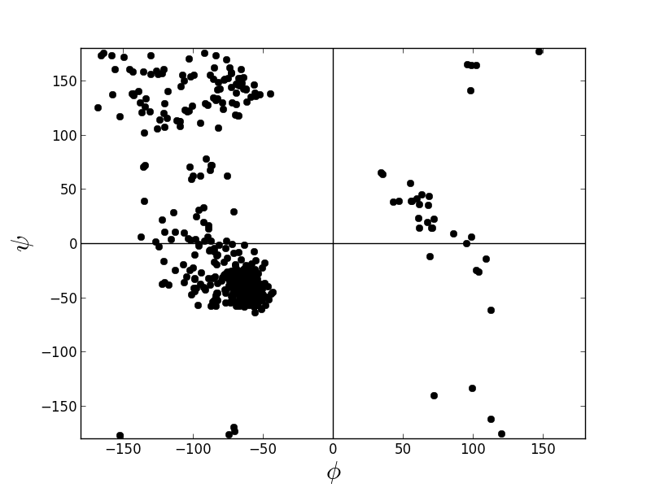

# Protein Utilities

Utilities to simplify the manipulation of PDB, PQR, DCD, BGF, SPH,
(and soon mol2, mae, etc.) files to prepare or analyze structures before or
after dynamics or other calculations.

Designed to allow working from an IPython (or other) prompt.

Some features include:

- Django-queryset-like selection tools
- Alignment and RMSD calculations/transformations
- RCSB, Ligand Expo, and BLAST lookups

Additional documentation available
[here](http://claudejrogers.github.io/protein_utils/)

## Build

Requires
- numpy
- matplotlib
- scikit-learn

To build, run:

    python setup.py build_ext --inplace

To run without installing:

    $ ipython
    In [1]: import sys

    In [2]: sys.path.insert(0, '/path/to/protein_utils/')

## Examples

### 1.0 Selections and Alignment

Download pdbs, quickly select a subsection of atoms, then align the structures

```python
In [1]: from protutils.pdb import PDBFile

In [2]: # Download 4K5Y.pdb from RCSB Protein Data Bank

In [3]: pdb = PDBFile.fetch('4K5Y')

In [4]: # Select residues less than 263 on chain A

In [5]: chain_a = pdb.select(chain__eq='A', nres__lt=263)

In [6]: chain_b = pdb.select(chain__eq='B', nres__lt=263)

In [7]: # Align selection with another selection that contains the same number of atoms

In [8]: aligned_chain_b = chain_b.align(chain_a)
RMSD = 0.983960869568

In [9]: chain_a.write_pdb('chain_a.pdb')

In [10]: chain_b.write_pdb('chain_b.pdb')

In [11]: aligned_chain_b.write_pdb('aligned_chain_b.pdb')
```

Now, we can visualize our selections:

```
# example.pml
load chain_a.pdb
load chain_b.pdb
load aligned_chain_b.pdb

zoom
show cartoon
ray
png example.png
```

to get (chain_a, green; chain_b, cyan; aligned_chain_b, magenta):


Better yet, use the [cealign](http://www.pymolwiki.org/index.php/Cealign)
algorithm to align molecules with different numbers of atoms.

```python
In [1]: from protutils.pdb import PDBFile

In [2]: pdb = PDBFile.fetch('4K5Y')

In [3]: chain_a = pdb.select(chain='A')  # equivalent to pdb.select(chain__eq='A')

In [4]: chain_b = pdb.select(chain='B')

In [5]: len(chain_a) == len(chain_b)
Out[5]: False

In [6]: # the align method would fail for these selections

In [7]: aligned_chain_b = chain_b.cealign(chain_a)
RMSD = 0.874903919378  # RMSD of alpha carbons

In [8]: chain_a.write_pdb('chain_a.pdb')

In [9]: chain_b.write_pdb('chain_b.pdb')

In [10]: aligned_chain_b.write_pdb('aligned_chain_b.pdb')
```

Visualizing as before:


### 1.1 Select By Distance and Chaining

```python
In [1]: from protutils.pdb import PDBFile

In [2]: # write a small helper function

In [3]: def residues_for_selection(selected, pdbfile):
   ...:     """Get all residues atoms for a selection
   ...:     """
   ...:     residues = {atm.nres for atm in selected}
   ...:     return pdbfile.select(nres__isin=residues)
   ...:

In [4]: pdb = PDBfile.fetch('1HPV')

In [5]: # Select ligand

In [6]: ligand = pdb.ligand()

In [7]: # select protein atoms with 5 Angstroms of the ligand

In [8]: atoms = pdb.protein().within(5.0, ligand)

In [9]: prot = residues_for_selection(atoms, pdb)

In [10]: ligand.write_pdb('ligand.pdb')

In [11]: prot.write_pdb('prot.pdb')
```

Again, visualize:

```
# example2.pml
load ligand.pdb
load prot.pdb

hide everything

show lines, prot
show sticks, ligand

zoom
ray
png example.png
```


### 1.2 Structure analysis

```python
In [1]: from protutils.pdb import PDBFile

In [2]: pdb = PDBFile.fetch('4K5Y')

In [3]: protein = pdb.protein()  # remove HETATM records

In [4]: protein.ramachandran_plot()
```



### 1.3 Orient protein along its principle axis

```python
In [1]: from protutils.pdb import PDBFile

In [2]: pdb = PDBFile.fetch('4K5Y')

In [3]: protein = pdb.select(chain='A', nres__lt=1000).protein()

In [4]: orient = protein.orient()

In [5]: protein.write_pdb('4K5YA.pdb')

In [6]: orient.write_pdb('4K5YA_0.pdb')
```

Visualize transformed structure in pymol with axes marked by rgb lines.


### 1.4 Search for similar structures

Find similar proteins using PDB BLAST.

```python
In [1]: from protutils.pdb import PDBFile

In [2]: from protutils.ncbi.blastp import BLASTPDBRecord

In [3]: pdb = PDBFile.fetch('4K5Y')

In [4]: chain_a = pdb.select(chain='A', nres__lt=1000)

In [5]: # Get sequence

In [6]: sequence = chain_a.sequence.replace('-', '')

In [7]: # search for similar sequences to 4K5Y_A

In [8]: query = BLASTPDBRecord(sequence)

In [9]: # Get top hit

In [10]: PDB = query.get_best()['pdb']

In [11]: PDB != '4K5Y'
Out[11]: True

In [12]: similar = PDBFile.fetch(PDB)

In [13]: similar.select(chain='A', nres__lt=1000)

In [14]: # Compare aligned structures

In [15]: aligned = similar.cealign(chain_a)
RMSD = 3.88137034902

In [16]: chain_a.write_pdb('4k5y_A.mod.pdb')

In [17]: aligned.write_pdb('{0}_A.mod.pdb'.format(PDB))

In [18]: # Compare the structures

In [19]: !pymol *.pdb
```


## Dependencies

* numpy
* matplotlib
* scikit-learn

## TODO

- [x] ~~Add tests~~
- [ ] Improve test coverage
- [ ] More atom record file types
- [x] ~~More sophisticated alignment tools~~
- [ ] Sequence alignments
